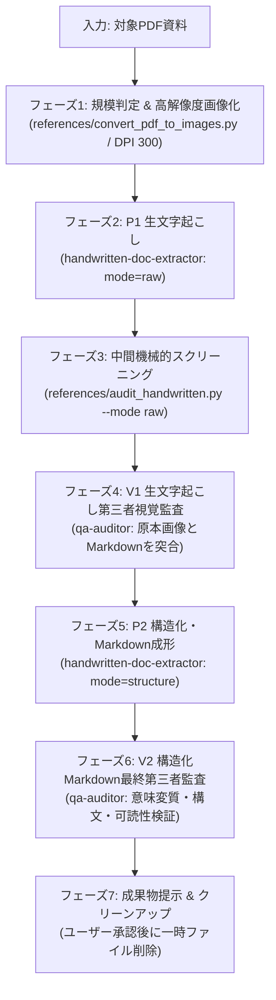

# 手書き資料のマークダウン変換「デジタルシフト」スキル
手書きのメモ・資料・契約書・議事録・アンケートなどアナログ紙媒体PDF/画像を、原本に極めて忠実な生文字起こし（P1）および体系的な構造化Markdown（P2）へ変換し、二重の第三者検証（機械的監査＋検証サブエージェント qa-auditorによる視覚突合監査）を徹底するスキルです。

<instructions>

## ルールと制約（絶対遵守）

- **事前承認（HITL）の必須化**: 各フェーズの開始前、コマンド実行前、およびサブエージェント起動前には、必ずユーザーへ作業内容と対象ファイルを提示し、「y（はい）」の承認を得てから実行すること。
- **作業ディレクトリの分離**: 作業ファイルは `tasks/digital-shift/` 配下で管理する。存在しない場合はユーザー承認を得て作成し、対象PDFの配置を依頼すること。
- **仮想環境の完全分離**: 画像変換（`pdf2image`）等で非標準ライブラリを使用する際は、必ず `tasks/digital-shift/.venv` 内で完結させ、ホスト環境を汚染しないこと。
- **実行環境（OS）への適応**: コマンド実行例は macOS/Linux 向けに記載されています。Windows 環境で実行する場合は、`python3` を `python`、仮想環境パスの `.venv/bin/` を `.venv/Scripts/` に読み替えて実行すること。
- **原本準拠の原則（推測・要約・編纂の完全禁止）**: 不鮮明な文字や略字をAIの自己判断で勝手に補完・創作することは厳禁。
- **判読不能マーキング規約の統一**:
  - 完全判読不能: `[判読不能]`
  - 推測可能だが確証なし: `[要確認: 〇〇？]`
  - 取り消し線・抹消: `[抹消線: 〇〇]`
  - 欄外追記・メモ: `[欄外追記: 〇〇]`
  - 図・イラスト・矢印: `[図/イラスト: 概要説明]`
- **自己検証の禁止と独立第三者検証の徹底**: メインエージェント単独での完了判定を禁止し、必ず検証サブエージェント（`qa-auditor`）による画像突き合わせ監査とPASS判定を得ること。

## ワークフロー


### フェーズ 1: 前提確認・規模判定と素材の画像化

1. **前提確認と規模判定**:
   - `tasks/digital-shift/` 内の対象PDFを確認し、総ページ数を判定する。
     - **小規模（5ページ未満 / 3,000〜5,000文字未満）**: Google AI Studio等の利用を案内。
     - **中規模（5〜20ページ）**: 本スキルの通常パイプラインで順次処理。
     - **大規模（20ページ超）**: コンテキスト圧迫防止のため、10〜12ページ単位のバッチに分割して実行。
   - ユーザーへ「手書き資料のデジタルシフト作業（全〇ページ）を開始します。よろしいですか？ (y/n)」と確認する。

2. **仮想環境の準備とPDF高解像度画像化**:
   - 承認後、`tasks/digital-shift/.venv` が未構築の場合は作成し、依存ライブラリをインストールする。
     ```bash
     python3 -m venv tasks/digital-shift/.venv
     tasks/digital-shift/.venv/bin/pip install -r .agents/skills/digital-shift/references/requirements.txt
     ```
   - 準備された画像化スクリプトを実行し、PDF各ページを高解像度画像（PNG、DPI 300）に一括変換する。
     ```bash
     tasks/digital-shift/.venv/bin/python3 .agents/skills/digital-shift/references/convert_pdf_to_images.py \
       --pdf "tasks/digital-shift/対象ファイル.pdf" \
       --output-dir "tasks/digital-shift/tmp/images" \
       --dpi 300 --format png
     ```

### フェーズ 2: P1 生文字起こし (Raw Transcript)
1. ユーザーに「特化型サブエージェント（`handwritten-doc-extractor`）による生文字起こしを開始します。よろしいですか？ (y/n)」と確認する。
2. 承認後、画像ごとに特化型カスタムサブエージェント（`@handwritten-doc-extractor`）を呼び出し、原本忠実な生文字起こしを実行させる。
   - **サブエージェントへの指示内容**:
     - `image_path`: `tasks/digital-shift/tmp/images/page_XX.png`
     - `output_path`: `tasks/digital-shift/tmp/raw/raw_page_XX.md`
     - `mode`: `"raw"`
     - `document_type`: 文書種別（手書きメモ、契約書等）
3. 全ページの生文字起こしファイルが出力されたことを確認する。

### フェーズ 3: 中間スクリーニング（機械的自動検査）
1. 用意された機械的監査スクリプトを実行し、文字数・未解決タグ・フォーマット異常を一次検査する。
   ```bash
   python3 .agents/skills/digital-shift/references/audit_handwritten.py \
     "tasks/digital-shift/tmp/raw" \
     --mode raw \
     --output-report "tasks/digital-shift/tmp/audit_raw_report.md"
   ```
2. エラー（閉じられていないタグや極端な空ファイル等）が検知された場合は、対象ファイルを `handwritten-doc-extractor` で再修正する。

### フェーズ 4: V1 生文字起こしの第三者視覚監査 (qa-auditor)
1. ユーザーに「検証サブエージェント（`qa-auditor`）による生文字起こしの原本突き合わせ監査を開始します。よろしいですか？ (y/n)」と確認する。
2. 承認後、検証専用サブエージェント（`@qa-auditor`）をオーバーソウルアプローチ（`utils/generate_subagent_prompt.py`）で起動して、視覚的突合監査を行わせる。
   - **ミッション・ブリーフ（指示内容）**:
     - 原本画像パス（`tasks/digital-shift/tmp/images/page_XX.png`）と生文字起こしパス（`tasks/digital-shift/tmp/raw/raw_page_XX.md`）を `view_file` で読み込むこと。
     - 画像上の手書き文字とテキストを照合し、「誤読」「欠落」「勝手な補完（ハルシネーション）」がないかを監査すること。
     - 合否判定（`PASS` / `FAIL`）と指摘事項を出力すること。
3. `FAIL` の指摘があった場合は、`handwritten-doc-extractor` に修正指示を出して再監査を行い、`PASS` を取得するまで繰り返す。

### フェーズ 5: P2 構造化・Markdown成形 (Structured Markdown)
1. ユーザーに「生文字起こしのPASSを確認しました。構造化Markdownへの成形を開始します。よろしいですか？ (y/n)」と確認する。
2. 承認後、特化型カスタムサブエージェント（`@handwritten-doc-extractor`）を呼び出し、体系的なMarkdownへ成形させる。
   - **サブエージェントへの指示内容**:
     - `image_path`: `tasks/digital-shift/tmp/images/page_XX.png`
     - `output_path`: `tasks/digital-shift/markdown/structured_page_XX.md`
     - `mode`: `"structure"`
     - 生文字起こしファイル（`raw_page_XX.md`）を参照し、見出し・表・箇条書き・メタデータを付与して成形。
3. 複数ページを結合して1つのMarkdownにする場合は、`tasks/digital-shift/markdown/output_full.md` に集約する。

### フェーズ 6: V2 構造化Markdownの最終第三者監査 (qa-auditor)
1. ユーザーに「検証サブエージェント（`qa-auditor`）による構造化Markdownの最終監査を開始します。よろしいですか？ (y/n)」と確認する。
2. 承認後、検証専用サブエージェント（`@qa-auditor`）をオーバーソウルアプローチで起動して、構造化Markdownの品質を最終監査する。
   - **ミッション・ブリーフ**:
     - 原本の持つ文意・数値が歪められていないか。
     - 見出し階層（H1〜H3）、表組み（GFM Table）、箇条書き構文が正しくレンダリング可能か。
     - 判読不能マーキングが正しく引き継がれているか。
3. `PASS` 判定を取得した時点で、最終成果物を確定する。

### フェーズ 7: 成果物提示とクリーンアップ
1. ユーザーへ最終出力された構造化Markdownファイル（`tasks/digital-shift/markdown/`）を提示・報告する。
2. `tasks/digital-shift/tmp/` 配下に作成された一時画像ファイル、中間生データ、監査レポートなどの削除対象リストをユーザーへ提示し、「一時ファイルをクリーンアップしてよろしいですか？ (y/n)」と確認する。
3. ユーザー承認後、安全にクリーンアップを実行してタスク完了とする。

</instructions>
